     

# Question1 - Flights at ABIA

 

#### Library several packages we will need.

 

    library(tidyverse)

    ## ── Attaching packages ─────────────────────────────────────── tidyverse 1.3.1 ──

    ## ✓ ggplot2 3.3.5     ✓ purrr   0.3.4
    ## ✓ tibble  3.1.6     ✓ dplyr   1.0.7
    ## ✓ tidyr   1.1.4     ✓ stringr 1.4.0
    ## ✓ readr   2.1.1     ✓ forcats 0.5.1

    ## ── Conflicts ────────────────────────────────────────── tidyverse_conflicts() ──
    ## x dplyr::filter() masks stats::filter()
    ## x dplyr::lag()    masks stats::lag()

    library(mosaic)

    ## Registered S3 method overwritten by 'mosaic':
    ##   method                           from   
    ##   fortify.SpatialPolygonsDataFrame ggplot2

    ## 
    ## The 'mosaic' package masks several functions from core packages in order to add 
    ## additional features.  The original behavior of these functions should not be affected by this.

    ## 
    ## Attaching package: 'mosaic'

    ## The following object is masked from 'package:Matrix':
    ## 
    ##     mean

    ## The following objects are masked from 'package:dplyr':
    ## 
    ##     count, do, tally

    ## The following object is masked from 'package:purrr':
    ## 
    ##     cross

    ## The following object is masked from 'package:ggplot2':
    ## 
    ##     stat

    ## The following objects are masked from 'package:stats':
    ## 
    ##     binom.test, cor, cor.test, cov, fivenum, IQR, median, prop.test,
    ##     quantile, sd, t.test, var

    ## The following objects are masked from 'package:base':
    ## 
    ##     max, mean, min, prod, range, sample, sum

    library(ggplot2)
    library(data.table)

    ## 
    ## Attaching package: 'data.table'

    ## The following objects are masked from 'package:dplyr':
    ## 
    ##     between, first, last

    ## The following object is masked from 'package:purrr':
    ## 
    ##     transpose

    library(rsample)
    library(caret)

    ## 
    ## Attaching package: 'caret'

    ## The following object is masked from 'package:mosaic':
    ## 
    ##     dotPlot

    ## The following object is masked from 'package:purrr':
    ## 
    ##     lift

    library(modelr)

    ## 
    ## Attaching package: 'modelr'

    ## The following object is masked from 'package:mosaic':
    ## 
    ##     resample

    ## The following object is masked from 'package:ggformula':
    ## 
    ##     na.warn

    library(parallel)
    library(foreach)

    ## 
    ## Attaching package: 'foreach'

    ## The following objects are masked from 'package:purrr':
    ## 
    ##     accumulate, when

 

### Question a: What’s the best time of year to fly to minimize delays?

 

    ##   mean_DepDelay
    ## 1            NA

    ##   min Q1 median Q3 max     mean       sd     n missing
    ## 1 -42 -4      0  8 875 9.171135 31.15531 97847    1413

    ##   mean_DepDelay
    ## 1      9.171135

    ## # A tibble: 175 × 4
    ## # Groups:   Month [12]
    ##    Month UniqueCarrier count mean_DepDelay
    ##    <int> <chr>         <int>         <dbl>
    ##  1     1 9E              175        17.4  
    ##  2     1 AA             1728         9.43 
    ##  3     1 B6              242         6.56 
    ##  4     1 CO              764         6.26 
    ##  5     1 DL               92         8.67 
    ##  6     1 EV              266        13.9  
    ##  7     1 F9              178         2.49 
    ##  8     1 MQ              460         0.991
    ##  9     1 NW               23        -1.57 
    ## 10     1 OH              281        11.2  
    ## # … with 165 more rows

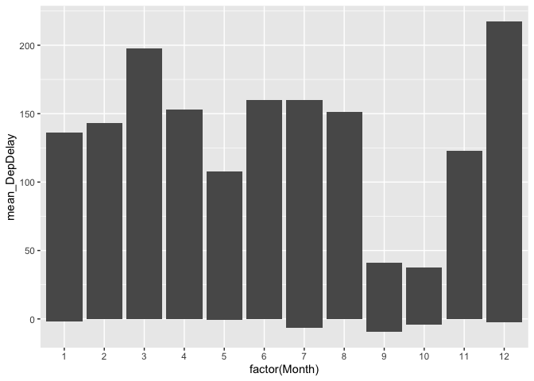

 

#### Answer:

#### The chart below shows that December is the worst time to fly since the highest mean-delay.

 

 

### Question b: Does the best time to fly to min delays change by destination?

 

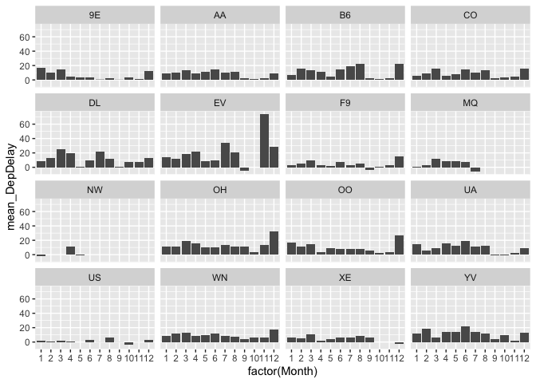

 

#### Answer:

#### Yes. Different airlines have different situation (shown in the last table). Take AA as example, the worst month is June apparently.

 

    ## # A tibble: 16 × 4
    ## # Groups:   UniqueCarrier [16]
    ##    Month UniqueCarrier count mean_DepDelay
    ##    <int> <chr>         <int>         <dbl>
    ##  1     1 9E              175         17.4 
    ##  2     6 AA             1719         14.2 
    ##  3    12 B6              489         22.4 
    ##  4    12 CO              743         16.0 
    ##  5     3 DL              121         25.3 
    ##  6    11 EV                2         74   
    ##  7    12 F9              168         14.8 
    ##  8     3 MQ              446         12.1 
    ##  9     4 NW               93         10.9 
    ## 10    12 OH               82         32.7 
    ## 11    12 OO              129         27.1 
    ## 12     6 UA              174         19.1 
    ## 13     8 US              120          5.91
    ## 14    12 WN             3022         17.8 
    ## 15     3 XE              762         11.1 
    ## 16     6 YV              512         21.5

       

# Question2 - Wrangling the Billboard Top100

 

## Part A

 

### Top 10 songs since 1958

 

    ##                                     performer
    ##  1:                           Imagine Dragons
    ##  2:                                AWOLNATION
    ##  3:                                Jason Mraz
    ##  4:                                The Weeknd
    ##  5:                               LeAnn Rimes
    ##  6: LMFAO Featuring Lauren Bennett & GoonRock
    ##  7:                               OneRepublic
    ##  8:                                     Adele
    ##  9:                                     Jewel
    ## 10:                          Carrie Underwood
    ##                                    song count
    ##  1:                         Radioactive    87
    ##  2:                                Sail    79
    ##  3:                           I'm Yours    76
    ##  4:                     Blinding Lights    76
    ##  5:                       How Do I Live    69
    ##  6:                   Party Rock Anthem    68
    ##  7:                      Counting Stars    68
    ##  8:                 Rolling In The Deep    65
    ##  9: Foolish Games/You Were Meant For Me    65
    ## 10:                    Before He Cheats    64

<table>
<caption>This is the top 10 songs since 1958 on Billboard!</caption>
<thead>
<tr class="header">
<th style="text-align: left;">performer</th>
<th style="text-align: left;">song</th>
<th style="text-align: right;">count</th>
</tr>
</thead>
<tbody>
<tr class="odd">
<td style="text-align: left;">Imagine Dragons</td>
<td style="text-align: left;">Radioactive</td>
<td style="text-align: right;">87</td>
</tr>
<tr class="even">
<td style="text-align: left;">AWOLNATION</td>
<td style="text-align: left;">Sail</td>
<td style="text-align: right;">79</td>
</tr>
<tr class="odd">
<td style="text-align: left;">Jason Mraz</td>
<td style="text-align: left;">I’m Yours</td>
<td style="text-align: right;">76</td>
</tr>
<tr class="even">
<td style="text-align: left;">The Weeknd</td>
<td style="text-align: left;">Blinding Lights</td>
<td style="text-align: right;">76</td>
</tr>
<tr class="odd">
<td style="text-align: left;">LeAnn Rimes</td>
<td style="text-align: left;">How Do I Live</td>
<td style="text-align: right;">69</td>
</tr>
<tr class="even">
<td style="text-align: left;">LMFAO Featuring Lauren Bennett &amp; GoonRock</td>
<td style="text-align: left;">Party Rock Anthem</td>
<td style="text-align: right;">68</td>
</tr>
<tr class="odd">
<td style="text-align: left;">OneRepublic</td>
<td style="text-align: left;">Counting Stars</td>
<td style="text-align: right;">68</td>
</tr>
<tr class="even">
<td style="text-align: left;">Adele</td>
<td style="text-align: left;">Rolling In The Deep</td>
<td style="text-align: right;">65</td>
</tr>
<tr class="odd">
<td style="text-align: left;">Jewel</td>
<td style="text-align: left;">Foolish Games/You Were Meant For Me</td>
<td style="text-align: right;">65</td>
</tr>
<tr class="even">
<td style="text-align: left;">Carrie Underwood</td>
<td style="text-align: left;">Before He Cheats</td>
<td style="text-align: right;">64</td>
</tr>
</tbody>
</table>

This is the top 10 songs since 1958 on Billboard!

 

## Part B

 

### Musical Diversity Trend

 

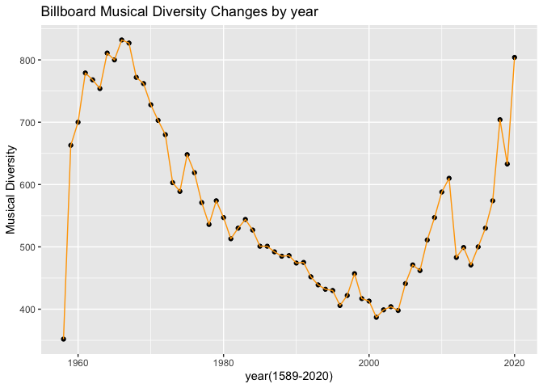

 

####  Conclusion:

####  Once Billboard was introduced to the public, the diversity of music goes up very quickly until reached the peak in the 1960s, then it starts to go down for a long time and reached the lowest point around the start of the 2020s. After that, it appeared to go up again.

 

## Part C

 

### Nineteen Artists with over 30 “ten-week-hit” songs

 

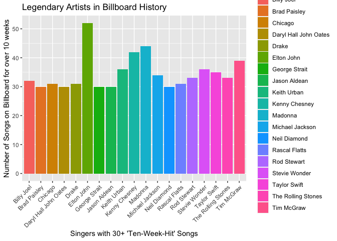

       

# Question3 - Wrangling the Olympics

 

## Part A

 

### 95 Percentile of Heignts for Female Competitors

 

    ##    id                                    name sex age height weight
    ## 1  37                      Ann Kristin Aarnes   F  23    182     64
    ## 2  67 Mariya Vasilyevna Abakumova (-Tarabina)   F  22    179     80
    ## 3  90               Tamila Rashidovna Abasova   F  21    163     60
    ## 4 259                              Reema Abdo   F  21    173     59
    ## 5 394                              Irene Abel   F  19    160     48
    ## 6 428                       Elvan Abeylegesse   F  25    159     40
    ##           team noc       games year season        city      sport
    ## 1       Norway NOR 1996 Summer 1996 Summer     Atlanta   Football
    ## 2       Russia RUS 2008 Summer 2008 Summer     Beijing  Athletics
    ## 3       Russia RUS 2004 Summer 2004 Summer      Athina    Cycling
    ## 4       Canada CAN 1984 Summer 1984 Summer Los Angeles   Swimming
    ## 5 East Germany GDR 1972 Summer 1972 Summer      Munich Gymnastics
    ## 6       Turkey TUR 2008 Summer 2008 Summer     Beijing  Athletics
    ##                                          event  medal
    ## 1                    Football Women's Football Bronze
    ## 2              Athletics Women's Javelin Throw Silver
    ## 3                       Cycling Women's Sprint Silver
    ## 4 Swimming Women's 4 x 100 metres Medley Relay Bronze
    ## 5           Gymnastics Women's Team All-Around Silver
    ## 6               Athletics Women's 5,000 metres Silver

    ##   q95_height
    ## 1        186

 

####  Female Competitor’s 95 percentile height is 186.

 

## Part B

 

### Women’s Event with the Greatest Variability in Competitor’s Height

 

    ## # A tibble: 1 × 2
    ##   event                      max_sd
    ##   <chr>                       <dbl>
    ## 1 Rowing Women's Coxed Fours   10.9

 

####  “Rowing Women’s Coxed Fours” has the greatest women height variability.

 

## Part C

 

### Average Age of Olympic Swimmers Trend

 

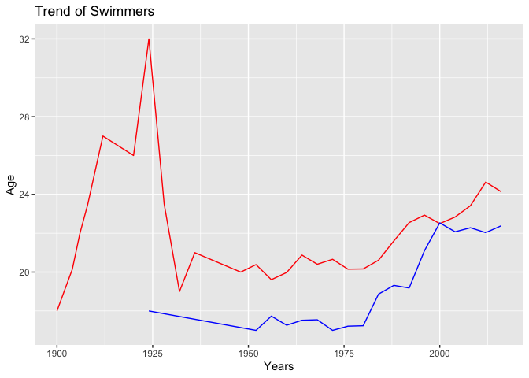

 

####  Concllusion: The trend bewteen male and female competitors is different. Female competitor’s ages are usually bigger than male’s. Both average ages began to increase gradually since 1950.

       

# Question4 - k-Nearest Neighbors

 

### Predictive Model

 

    ## [1] 10898.63

    ## [1] 10782.56

 

### 350’s AMG

 

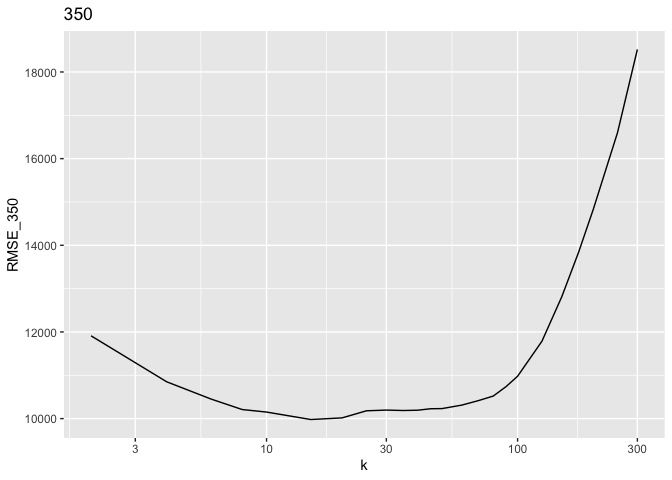

 

####  From the picture we guess that RMSE\_350 reaches its bottom when k is in \[10,20\].

 

### 65’s AMG

 

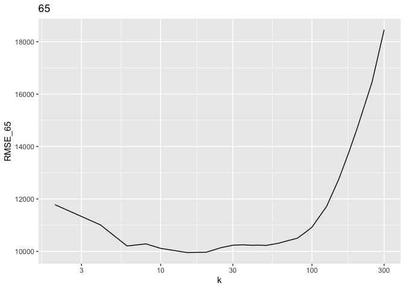

 

####  From the picture we guess that RMSE\_65 reaches its bottom when k is in \[10,20\].

 

### Calculating 350’s and 65’s AMG optimal k value

 

    ##    k
    ## 1 20

    ##    k
    ## 1 15

 

####  Optimal k’s for 350’s and 65’s are both 15.

 

### sclass\_350\_test

 

    ## [1] 10948.62

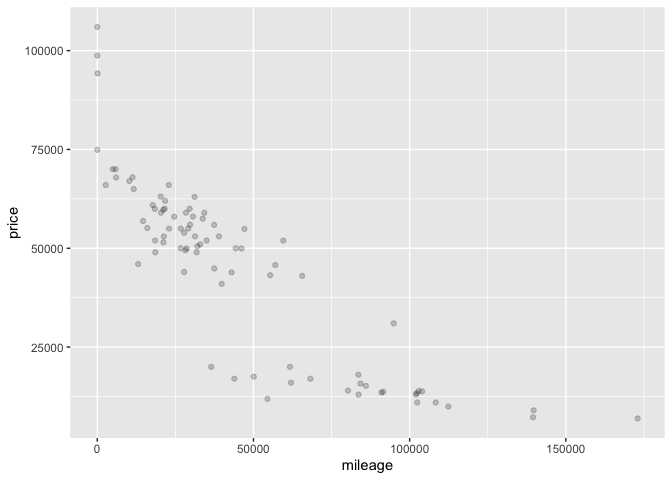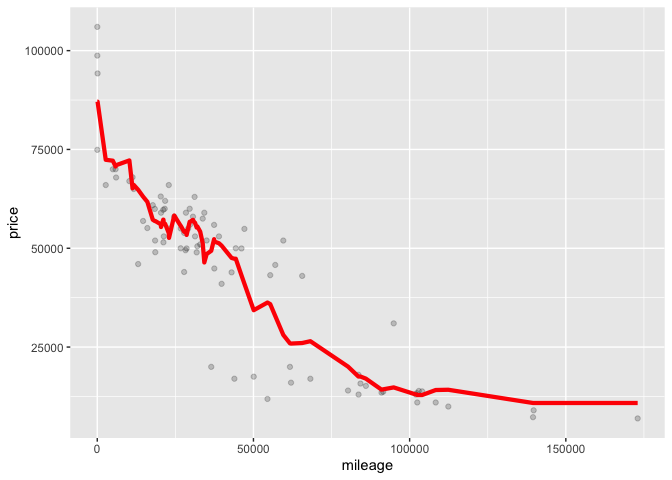

 

### sclass\_65\_test

 

    ## [1] 21135.69

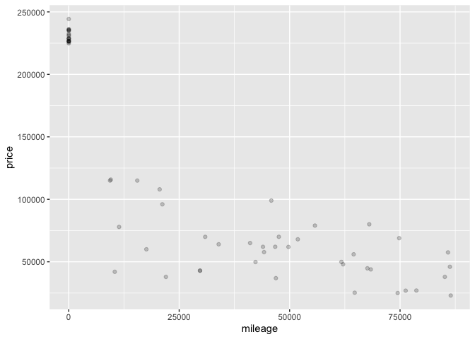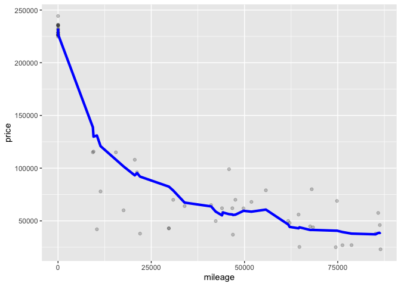

 

####  Two trims yields the same optimal k value. This mignt be because in this kind of situations, not mather the car’s trim level changes, k = 15 is always the optimal value for doing KNN. Car’s trim level might not be an influential factor .

   
